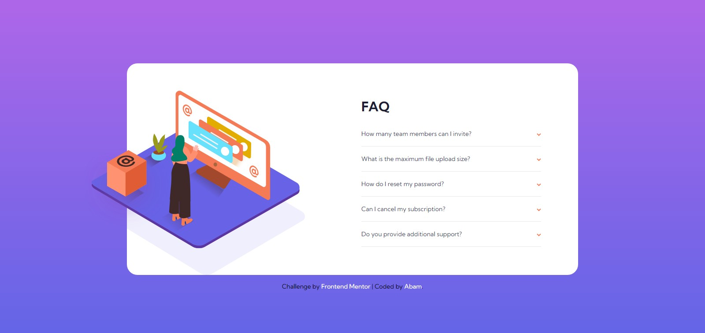

# Frontend Mentor - FAQ accordion card solution 👋

This is a solution to the [FAQ accordion card challenge on Frontend Mentor](https://www.frontendmentor.io/challenges/faq-accordion-card-XlyjD0Oam). Frontend Mentor challenges help you improve your coding skills by building realistic projects.

## Table of contents

- [Overview](#overview)
  - [The challenge](#the-challenge)
  - [Screenshot](#screenshot)
  - [Links](#links)
- [My process](#my-process)
  - [Built with](#built-with)
  - [What I learned](#what-i-learned)
  - [Continued development](#continued-development)
  - [Useful resources](#useful-resources)
- [Author](#author)
- [Acknowledgments](#acknowledgments)

## Overview

### The challenge

Users should be able to:

- View the optimal layout for the component depending on their device's screen size
- See hover states for all interactive elements on the page
- Hide/Show the answer to a question when the question is clicked

### Screenshot

### Links

- Solution URL: [solution](https://your-solution-url.com)
- Live Site URL: [live site](https://your-live-site-url.com)

## My process

### Built with

- Semantic HTML5 markup
- CSS custom properties
- Flexbox
- CSS Grid
- Tailwind CSS
- Mobile-first workflow

### What I learned

In this Accordion FAQ challenge, I learned how to make an accordion component using HTML, Tailwind CSS, and a little JavaScript for the interactive accordion and a slide down animation.

### Continued development

For the future project, i would like to learn more about Tailwind CSS, probably i am going to use React + Tailwind.

### Useful resources

- [Tailwind](https://tailwindcss.com/docs) - This helped me for the Tailwind utility classes.
- [W3School](https://www.w3schools.com/howto/howto_js_accordion.asp) - This site helped me for the accordion animation.

## Author

- Website - [Abam](https://abams.vercel.app/)
- Frontend Mentor - [@Zulfaabam](https://www.frontendmentor.io/profile/Zulfaabam)
- Twitter - [@zabamz1](https://www.twitter.com/zabamz1)

## Acknowledgments

-
